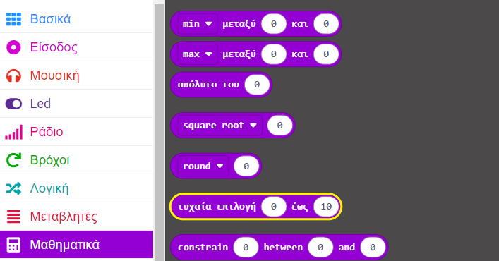

## Τυχαίοι αριθμοί στο MakeCode

Κάποια τυχαιότητα μπορεί να σε βοηθήσει να κάνεις τα προγράμματά σου λίγο διαφορετικά κάθε φορά που εκτελούνται, το οποίο ενισχύει τον ενθουσιασμό.

Μπορείς να βρεις το μπλοκ `τυχαία επιλογή`{:class='microbitbasic'} στο μενού `Μαθηματικά`{:class='microbitbasic'} στην Εργαλειοθήκη σου.



Άλλαξε το «0» και το «10» στο εύρος που θέλεις να λαμβάνουν οι τυχαίοι αριθμοί σου.

Για να χρησιμοποιήσεις τον τυχαίο αριθμό στο πρόγραμμά σου, θα πρέπει επίσης να δημιουργήσεις μια 'Μεταβλητή'{:class='microbitvariables'} για να κρατήσεις τον τυχαίο αριθμό σου.

```microbit
let tune = 0
input.onGesture(Gesture.Shake, function () {
    tune = randint(1, 4)
})
```
