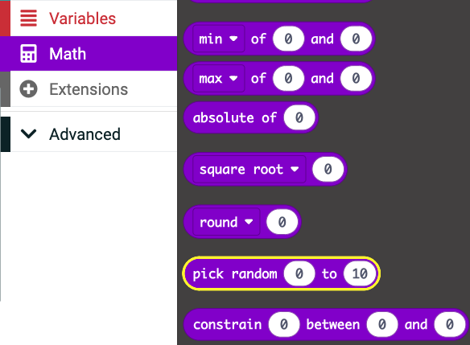

## Random numbers in MakeCode

A bit of randomness can help make your programs a little bit different every time they run, how exciting!

You can find the <code style="background-color: #9400d3">pick random</code> block in the <code style="background-color: #9400d3">Math</code> menu of your Toolbox.

Change the `0` and `10` to the range you want your random numbers to take.

In order to use it in your programs you will have to create a <code style="background-color: #dc143c">Variable</code> to hold your random number. 

<iframe style="position:relative;top:0;left:0;width:100%;height:100%;" src="https://makecode.microbit.org/---codeembed#pub:S92553-24531-21480-34085" allowfullscreen="allowfullscreen" frameborder="0" sandbox="allow-scripts allow-same-origin"></iframe>
