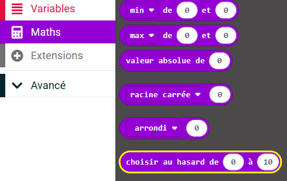

## Nombres aléatoires dans MakeCode

Un peu de hasard peut rendre ton programme un peu différent à chaque fois qu’il s’exécute, ce qui le rend encore plus amusant.

Tu peux trouver le bloc `choisir au hasard`{:class='microbitmath'} dans le menu `Maths`{:class='microbitmath'} de ta boîte à outils.



Remplace `0` et `10` par la plage que tu veux que tes nombres aléatoires prennent.

Pour utiliser le nombre aléatoire dans ton programme, tu devras également créer une `Variable`{:class='microbitvariables'} pour conserver ton nombre aléatoire.

```microbit
let tune = 0
input.onGesture(Gesture.Shake, function () {
    tune = randint(1, 4)
})
```
