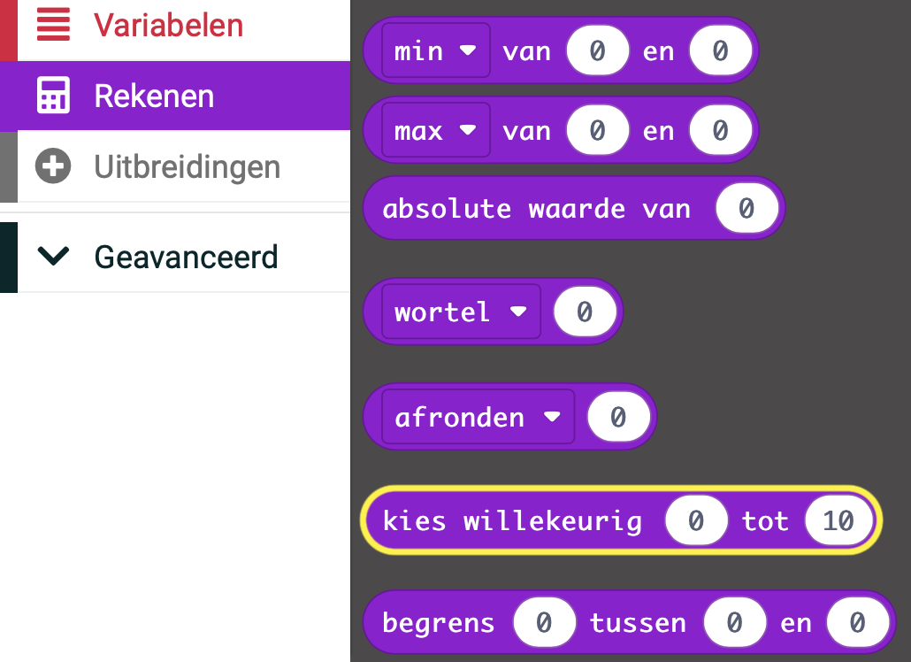

## Willekeurige getallen in MakeCode

Een beetje willekeurigheid kan je programma's een beetje anders maken elke keer dat ze draaien, waardoor het extra spannend wordt.

Je kunt het blok `kies willekeurig`{:class='microbitmath'} vinden in het `Rekenen`{:class='microbitmath'} menu van je Toolbox.



Verander de `0` en `10` naar het bereik dat je wilt dat jouw willekeurige getallen aannemen.

Om het willekeurige getal in je programma te gebruiken, moet je ook een `Variabele`{:class='microbitvariables'} maken om je willekeurig getal in op te slaan.

```microbit
let deuntje = 0
input.onGesture(Gesture.Shake, function () {
    deuntje = randint(1, 4)
})
```
